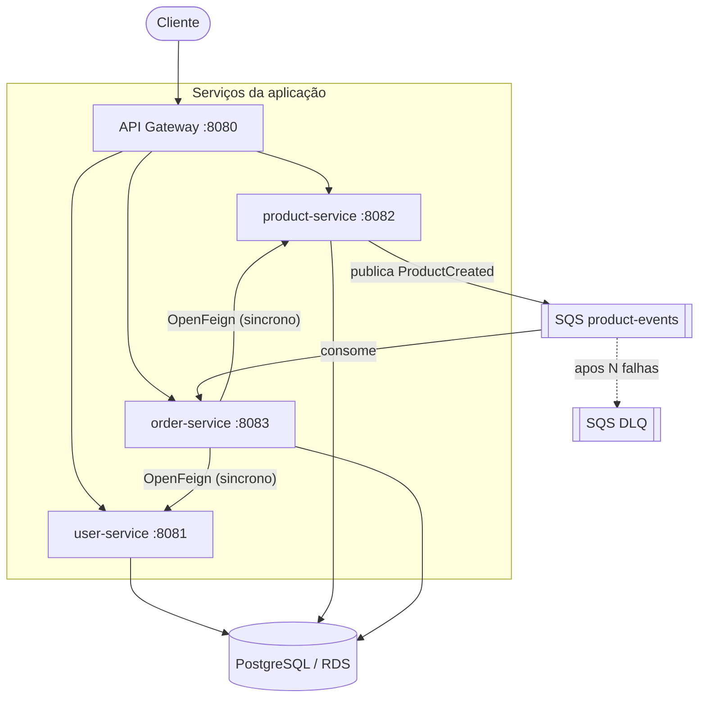
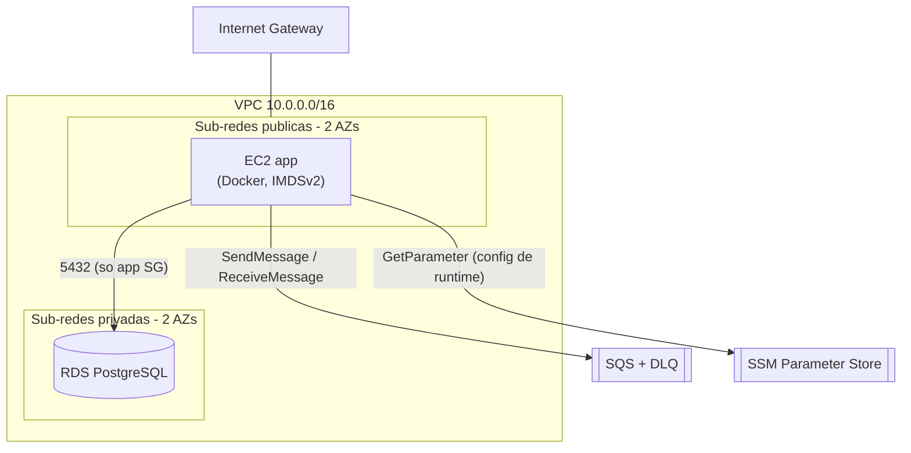
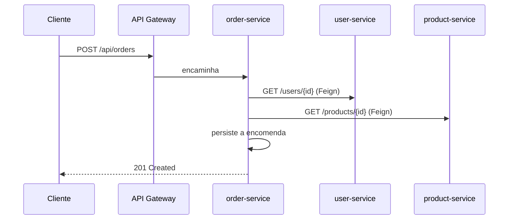

# Arquitetura

## Visão geral

Um sistema de microsserviços cloud-native (Abordagem A — estende a aplicação de
referência dos laboratórios). Quatro serviços Spring Boot comunicam de forma
síncrona através de uma API gateway e do OpenFeign, e de forma assíncrona através
de uma fila de mensagens (Kafka localmente, AWS SQS na cloud). Tudo é provisionado
na AWS com Terraform.

| Serviço | Porta | Responsabilidade | Comunica com |
|---------|-------|------------------|--------------|
| `api-gateway` | 8080 | Ponto de entrada único, encaminhamento | todos os serviços |
| `user-service` | 8081 | CRUD de utilizadores | BD |
| `product-service` | 8082 | Catálogo de produtos + stock; **publica** eventos de produto | BD, SQS (produtor) |
| `order-service` | 8083 | Encomendas; valida utilizador/produto; **consome** eventos de produto | BD, user/product (Feign), SQS (consumidor) |

## Diagrama de componentes

## Padrões de comunicação

**Síncrono (pedido/resposta).** Os clientes chamam a API gateway, que encaminha
para um serviço. O `order-service` faz chamadas síncronas via OpenFeign para
validar o utilizador e obter os detalhes do produto antes de criar uma encomenda.

**Assíncrono (orientado a eventos).** O `product-service` publica um evento
`ProductCreated` após um `POST /products` bem-sucedido. O `order-service` faz
long-polling da mesma fila e processa os eventos de forma independente — por isso
um consumidor lento ou em baixo nunca bloqueia o produtor. As mensagens com falha
são reprocessadas e, após `maxReceiveCount` (5), movidas para uma fila de
mensagens mortas (DLQ) para inspeção/redrive.

- Localmente, o transporte assíncrono é o **Kafka** (`docker-compose.kafka.yml`).
- Na cloud, é o **AWS SQS** (fila principal + DLQ), ativado pelas variáveis de
  ambiente `CLOUD_SQS_*`.

## Infraestrutura cloud

Provisionada por Terraform em [`infrastructure/terraform`](../infrastructure/terraform).
Região `eu-central-1`.

- **Rede:** VPC personalizada, 2 sub-redes públicas + 2 privadas em 2 AZs,
  Internet Gateway, tabelas de rota, NAT gateway opcional. Tier público = app;
  tier privado = BD.
- **Computação:** EC2 (Amazon Linux 2023, IMDSv2 obrigatório, volume raiz
  encriptado, Docker instalado via user-data). Acesso por SSH (opcional) ou SSM
  Session Manager.
- **Base de dados:** RDS PostgreSQL nas sub-redes privadas,
  `publicly_accessible = false`, acessível apenas a partir do grupo de segurança
  da aplicação na porta 5432. Os serviços ligam-se a esta BD no perfil
  `production` (em dev local usam H2 em memória).
- **Mensageria:** fila SQS `product-events` + DLQ com redrive policy.
- **Configuração:** os valores de runtime (host/porta/nome/utilizador da BD,
  palavra-passe como SecureString, URL da fila) são publicados no SSM Parameter
  Store em `/microservices/<env>/`, lidos pela EC2 através do seu papel IAM —
  sem credenciais no código.

## Fluxo de dados: criar uma encomenda

## Ambientes

Dois ambientes reproduzíveis partilham os módulos mas diferem nos tfvars:

- **dev** — orientado ao Free Tier: `t3.micro`, `db.t3.micro` single-AZ, sem NAT.
- **prod** — próximo de produção: RDS Multi-AZ, NAT gateway, proteção contra
  eliminação (não é Free Tier).

O estado é guardado remotamente no S3 com bloqueio via DynamoDB, com uma chave de
estado por ambiente.
